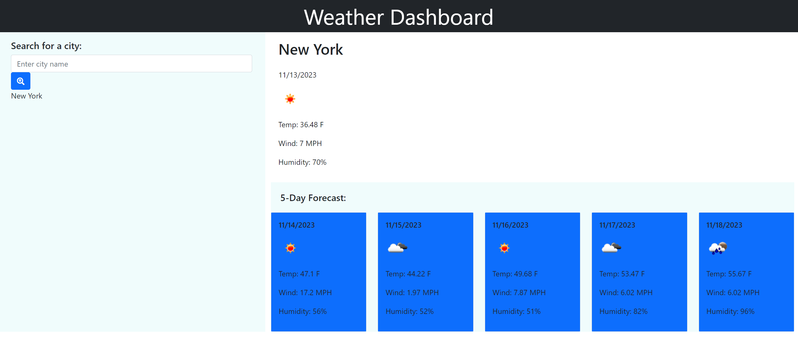

# Weather Dashboard

## Description of the project
This project is a simple weather dashboard that allows the user to perform a search by city and see the weather in this city for the current day and the next 5 days.

## Technologies used
Project is created using:
* HTML5
* CSS3
* JavaScript
* Third party API (jQuery, DayJS, Bootstrap)
* Server-Side-API (OpenWeather)

## Mockup

## Installation
Here are some guidelines for installing the project on your local machine:

1. Clone or download the repository to your own local machine.

2. Open the HTML file in your browser.

## Link URL to deployed app on GitHub
https://kateredkina.github.io/weather-dashboard/

## Link URL to GitHub Repository
https://github.com/KateRedkina/weather-dashboard